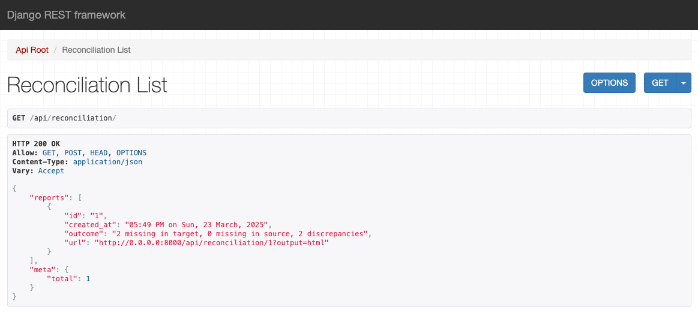

# Assessment


## Approach

1. **Django REST Framework & Clear Project Structure**
Leveraged DRF for clean separation of concerns and simple endpoint creation. Code is organized into distinct modules (engine logic, serializers, views) for maintainability.

1. **File-Based Reconciliation Logic**
Centralized the CSV parsing and comparison flow in `reconciliation_engine.py`, using helper utilities (`parse_csv`, `normalize_record`, etc.) for extensibility and clarity.

1. **Ephemeral In-Memory Data Storage**
Stored reconciliation results in a simple dictionary for quick prototype functionality, demonstrating how to create and fetch reports without database overhead.

1. **Robust Testing Strategy**
Maintained a dedicated `tests/` folder with focused test files for engine logic, serializers, and views, ensuring both happy paths and edge cases are covered.

1. **Flexible Output Formats**
Supported JSON, CSV, and HTML responses to address different client needs, showcasing how to adapt response formats with minimal extra code.

1. **Atomic Commits & Readable Repo History**
Kept the commit history transparent and incremental, reflecting each logical addition or refactor step by step.

### API Root


### Reconciliation Endpoint



### Reconciliation HTML Report


## Setup

The project uses docker for ease of development. If you don't have docker, follow the instructions [here](https://docs.docker.com/engine/install/) to install docker on your machine.

Git clone this repo:

```sh
git clone https://github.com/akhenda/credrails
```

Build and run the server

```sh
docker compose up --build
```

If you don't want to use docker, make sure you have `venv`, `virtualenv` and `pipenv` installed then change to the `backend` directory and run the following command to initialize your virtual environment.

```sh
pipenv shell
```

Then install dependencies by running:

```sh
pipenv install
```

To run the server, run:

```sh
pipenv run dev
```

To lint the project, run:

```sh
pipenv run lint
```

To run tests, run:

```sh
pipenv run test
```

To watch tests while developing, run:

```sh
pipenv run test:watch
```

To run coverage, run:

```sh
pipenv run coverage:run
```

TO generate the coverage report, run:

```sh
pipenv run coverage:report
```

```
Name                                  Stmts   Miss  Cover   Missing
-------------------------------------------------------------------
api/__init__.py                           0      0   100%
api/admin.py                              0      0   100%
api/apps.py                               4      0   100%
api/migrations/0001_initial.py            5      0   100%
api/migrations/__init__.py                0      0   100%
api/models.py                             7      1    86%   9
api/reconciliation_engine.py            121      5    96%   39-40, 58-59, 120
api/serializers.py                       10      0   100%
api/tests.py                              0      0   100%
api/urls.py                               6      0   100%
api/views.py                             80     38    52%   21-22, 38-61, 69-97, 109, 151-157, 160-161
manage.py                                11      2    82%   12-13
reconciliation/__init__.py                0      0   100%
reconciliation/settings.py               24      0   100%
reconciliation/urls.py                    4      0   100%
tests/__init__.py                         0      0   100%
tests/test_reconciliation_engine.py      78      0   100%
tests/test_serializers.py                 0      0   100%
tests/test_views.py                      34      3    91%   70-72
tests/utils.py                           11      0   100%
-------------------------------------------------------------------
TOTAL                                   395     49    88%
```

**PS:**

- The test watcher uses `watchexec`. Make sure it is installed to enable this Developer Experience (DX).

    ```sh
    brew install watchexec
    ```

- This project uses [Ruff](https://docs.astral.sh/ruff/) for linting & formatting to make sure our coding style is consistent.

### Notes

The server stores the reports in-memory, so the data you work with will be reset to the initial state each time the server is restarted.

#### Improvements

Given time, I would implement the following:

- Properly set a database for persistence.
- Maybe leverage redis to cache reports in that if the input is unchanged, a cache is returned instead of doing the computation again. This would help with scaling since it does not waste compute.
- Add comprehensive observability i.e. logging using a service like betterstack, monitoring using betterstack, error tracing using sentry etc
